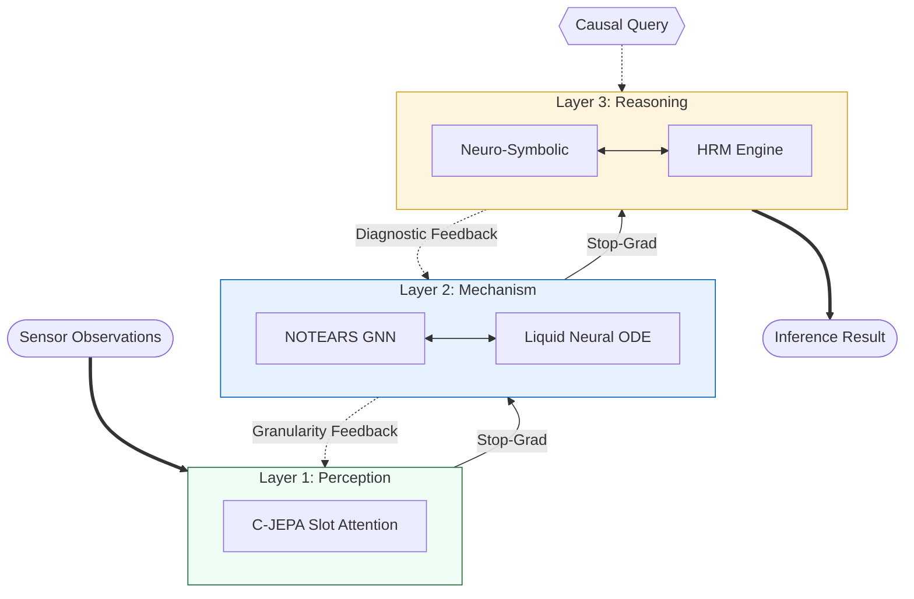

# HHCRA: Hierarchical Hybrid Causal Reasoning Architecture


A three-layer neuro-symbolic framework for Structural Causal Model (SCM) estimation and inference, covering Pearl's Ladder of Causation.

## Technical Overview

HHCRA implements a modular decomposition of SCM components into differentiable and symbolic modules. The architecture is designed for staged training with gradient isolation between hierarchical layers.

### Formal Definition

The architecture is grounded in the Structural Causal Model (SCM) framework:
$M = \langle V, U, F, P(u) \rangle$
- **$V$**: Endogenous variables (Layer 1 features).
- **$U$**: Exogenous noise variables (stochastic components).
- **$F$**: Set of structural equations (Layer 2 Liquid Dynamics).
- **$G$**: Causal DAG directed by NOTEARS optimization.

### Architecture Topology



### Component Mapping
| SCM Component | Module | Layer |
|---|---|---|
| **V** (Variables) | C-JEPA | 1 |
| **G** (Topology) | Causal GNN (NOTEARS) | 2 |
| **F** (Mechanisms) | Liquid Neural Network (RK4) | 2 |
| **$P(Y \mid do(x))$, $P(Y_{x'} \mid x, y)$** | Neuro-Symbolic Engine | 3 |
| **Orchestration** | HRM (GRU + ACT) | 3 |

## Implementation Details

### Layer 1: Representation Learning
- **Mechanism**: Causal Joint Embedding Predictive Architecture (C-JEPA).
- **Method**: Latent object-level representations are extracted via slot attention with temporal consistency constraints and mask-prediction objectives.

### Layer 2: Structure Discovery & Mechanism Modeling
- **DAG Learning**: Implementation of the **NOTEARS** (Zheng et al., 2018) augmented Lagrangian formulation: `min F(W) + λ·h(W) + (ρ/2)·h(W)²`, where `h(W) = tr(e^(W∘W)) - d`.
- **Dynamics Modeling**: Structural equations are modeled as **Liquid Time-constant Networks** (Hasani et al., 2021). Integration is performed using a 4th-order Runge-Kutta (RK4) solver via `torchdiffeq`.

### Layer 3: Symbolic Reasoning
- **Inference Engine**: Algorithmic implementation of Pearl's three rules of do-calculus and the ID-Algorithm (Tian & Pearl, 2002).
- **Counterfactuals**: Evaluation via the Abduction-Action-Prediction (ABP) protocol using MLE exogenous noise estimation.

## Changelog (v0.5.0)

- **Bugfix**: Counterfactual ABP procedure now correctly uses modified adjacency (`mod_adj`) with incoming edges cut, fixing Rung 3 predictions.
- **Performance**: BFS algorithms use `deque.popleft()` (O(1)) instead of `list.pop(0)` (O(n)); Layer 1 `compute_loss` vectorized over T dimension; `itertools.combinations` replaces recursive subset enumeration.
- **Stability**: Gradient clipping (max_norm=5.0) in all training stages; DAG penalty clamped non-negative; import cleanup.
- **Validation**: Config validation extended to HRM and training parameters; 24 new tests added.

## Technical Constraints & Assumptions

- **Acyclicity Requirement**: The structure discovery module (NOTEARS) assumes a Directed Acyclic Graph (DAG) topology. Accuracy on graphs containing feedback loops is not guaranteed.
- **Computational Overhead**: The use of Neural ODEs with adaptive RK4 solvers increases per-inference FLOPs compared to discrete-time architectures.
- **Hyperparameter Sensitivity**: Latent variable resolution is dependent on slot-attention bottleneck dimensions and temporal smoothing coefficients.
- **Hardware-Aware Implementation (v2 Prototype)**: The current single-file demonstration (`hhcra_v2.py`) is an intentionally compromised prototype optimized for low-specification local laptop environments. While the original design necessitates GPU-accelerated PyTorch and `torchdiffeq`-based continuous ODE solvers, this prototype utilizes pure NumPy for CPU computation. This design choice prioritizes local portability and immediate executability over the parallel processing efficiency and superior convergence speeds of the intended GPU-based implementation.

## Verification & Usage

The implementation has been verified against a 5-graph benchmark suite.

- **Unit Tests**: 170/170 passed (Verified locally via `pytest tests/ -v`).
- **Dependencies**:
    - **Intended Architecture**: Python ≥ 3.8, PyTorch ≥ 2.0, SciPy, `torchdiffeq` (required for the full GPU-accelerated framework).
    - **Local Prototype (`hhcra_v2.py`)**: Strictly depends only on **NumPy and SciPy** for local CPU execution, ensuring accessibility on standard laptop hardware.

### Execution
```bash
pip install -e ".[dev]"
python -m hhcra.main  # Benchmark and demo runner
```

## References

1. Pearl, J. (2009). *Causality: Models, Reasoning, and Inference*. Cambridge University Press.
2. Zheng, X. et al. (2018). DAGs with NO TEARS. *NeurIPS*.
3. Tian, J. & Pearl, J. (2002). On the Identification of Causal Effects. *UAI*.
4. Hasani, R. et al. (2021). Liquid Time-constant Networks. *AAAI*.
5. Graves, A. (2016). Adaptive Computation Time for RNNs. *arXiv:1603.08983*.
