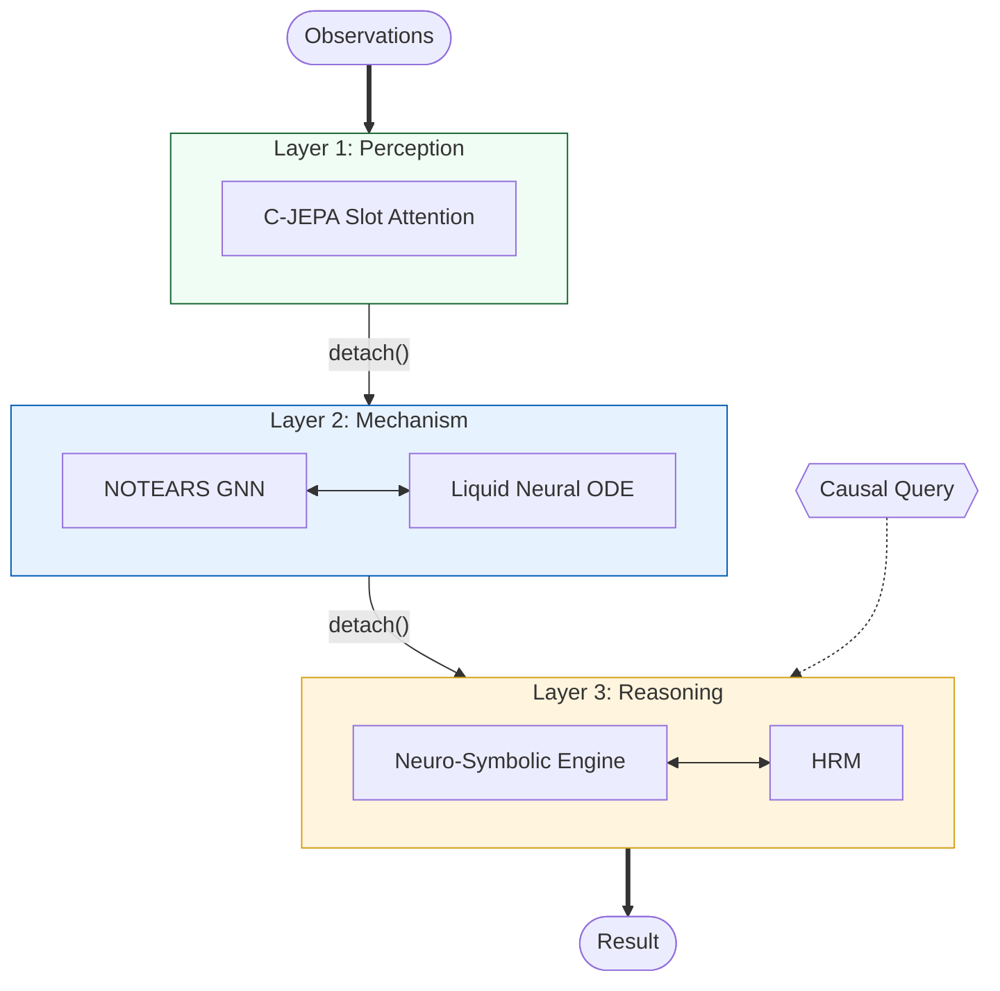

# HHCRA: Hierarchical Hybrid Causal Reasoning Architecture


A three-layer neuro-symbolic architecture for Structural Causal Model (SCM) estimation and causal inference. HHCRA combines slot-attention-based variable extraction, continuous DAG optimization, and symbolic causal reasoning to address Pearl's causal hierarchy (association, intervention, counterfactual).

**Status:** Research prototype. Not validated on real-world observational data. See [Limitations](#limitations).

## Overview

HHCRA decomposes SCM inference into three hierarchical layers with gradient isolation (`detach()`) between layers and staged optimization. Each layer is trained independently.

### SCM Formulation

The architecture maps to the SCM tuple $M = \langle V, U, F, P(u) \rangle$:
- $V$: Endogenous variables, extracted by Layer 1.
- $U$: Exogenous noise variables (stochastic components).
- $F$: Structural equations, modeled by Layer 2 dynamics.
- $G$: Causal DAG, learned via NOTEARS continuous optimization.

### Architecture



### Component Mapping

| SCM Component | Module | Layer | Based On |
|---|---|---|---|
| $V$ (Variables) | C-JEPA | 1 | Slot Attention (Locatello et al., 2020) |
| $G$ (Topology) | Causal GNN | 2 | NOTEARS (Zheng et al., 2018) |
| $F$ (Mechanisms) | Liquid Neural Network | 2 | LTC Networks (Hasani et al., 2021) |
| $P(Y \mid do(x))$, $P(Y_{x'} \mid x, y)$ | Neuro-Symbolic Engine | 3 | Pearl's do-calculus |
| Reasoning orchestration | HRM (GRU + ACT) | 3 | Graves (2016) |

## Method

### Layer 1: Latent Variable Extraction

Causal Joint Embedding Predictive Architecture (C-JEPA). Slot attention with competitive softmax decomposes observations into $N$ latent variable representations. Temporal consistency is enforced via exponential smoothing. Training objective: masked slot prediction.

**Known issue:** Slot attention does not guarantee bijective correspondence between learned slots and true causal variables. This is the primary bottleneck for end-to-end accuracy (see [Failure Analysis](#failure-analysis)).

### Layer 2: Structure and Mechanism Learning

- **Structure**: NOTEARS (Zheng et al., 2018) augmented Lagrangian formulation: $\min_W F(W) + \lambda \|W\|_1 + \alpha \cdot h(W) + \frac{\rho}{2} h(W)^2$, where $h(W) = \mathrm{tr}(e^{W \circ W}) - d$.
- **Dynamics**: Liquid Time-Constant Networks (Hasani et al., 2021) with per-variable ODE $dx_i/dt = g_i \cdot (-x_i + f_i(x_i, \mathrm{pa}_i)) / \tau_i$. Integration via RK4.

In v0.6.0, when raw data is available, Layer 2 receives it directly (bypassing Layer 1) for NOTEARS warm initialization. This improves structure learning but removes the end-to-end perception-to-structure pipeline.

### Layer 3: Causal Reasoning

- **Symbolic inference**: d-separation (Bayes-Ball), backdoor/frontdoor criteria, do-calculus (3 rules), ID algorithm (Tian & Pearl, 2002), instrumental variable detection.
- **Counterfactuals**: Variable-space SCM fitting with ABP/total-effect ensemble for robust counterfactual prediction.
- **HRM**: Hierarchical Reasoning Model with dual-timescale GRU recurrence and Adaptive Computation Time (Graves, 2016).

### Experimental Extensions (v0.6.0)

The following modules are implemented but **not yet validated on benchmarks**:

- **Liquid Causal Graph**: Co-evolving ODE system where graph weights $W(t)$ evolve jointly with state $x(t)$. Replaces the static adjacency matrix with a dynamical system.
- **Symbolic Genesis Engine**: Neural network-based invariant detection from ODE trajectories. Attempts to discover conserved quantities ($dh/dt \approx 0$).
- **Autocatalytic Causal Network**: Iterative feedback loop running GNN, Liquid ODE, and symbolic components in sequence with early stopping.

These extensions are accessible via `HHCRASingularity` but have no benchmark evidence of performance improvement over the base architecture.

## Evaluation

### Toy Graph Benchmarks (v0.4)

Evaluated on 5 synthetic linear-Gaussian SCMs (chain, fork, collider, diamond, 8-variable complex). Full results in `results/REPORT.md`.

#### Structure Learning (SHD, lower is better)

| Graph | Vars | Edges | Temporal Granger | Direct NOTEARS | Full Pipeline | PC |
|-------|------|-------|-----------------|----------------|---------------|-----|
| chain | 4 | 3 | 4 | 6 | 14 | 3 |
| fork | 3 | 2 | 1 | 5 | 16 | 0 |
| collider | 3 | 2 | 2 | 3 | 12 | 4 |
| diamond | 4 | 4 | 4 | 9 | 12 | 4 |
| complex | 8 | 9 | 10 | 18 | 13 | 9 |

**Observation:** The full pipeline (Layer 1 + Layer 2) performs worse than standalone NOTEARS or Granger on all graphs. Root cause: variable alignment failure in Layer 1 (see [Failure Analysis](#failure-analysis)).

#### Interventional Accuracy

| Graph | Naive MSE | HHCRA MSE | HHCRA beats Naive |
|-------|-----------|-----------|-------------------|
| chain | 6.925 | 0.660 | Yes |
| fork | 5.432 | 0.503 | Yes |
| collider | 1.266 | 0.350 | Yes |
| diamond | 4.767 | 0.472 | Yes |
| complex | 9.108 | 0.246 | Yes |

HHCRA interventional predictions beat the naive (correlation-based) baseline on 5/5 graphs.

#### Counterfactual Accuracy

| Graph | HHCRA CF MSE | Intervention-Only MSE | CF beats Intervention-Only |
|-------|-------------|----------------------|---------------------------|
| chain | 0.000 | 0.007 | Yes |
| fork | 0.000 | 0.006 | Yes |
| collider | 0.000 | 1.202 | Yes |
| diamond | 0.007 | 0.030 | Yes |
| complex | 0.069 | 0.112 | Yes |

HHCRA counterfactual predictions beat the intervention-only baseline on **5/5 graphs** (v0.7.0: variable-space SCM fitting with ABP/total-effect ensemble).

### Standard Benchmarks (v0.6.0)

Evaluated on Asia (8 vars, 8 edges) and Sachs (11 vars, 17 edges) with linear-Gaussian SEM data generation (not original datasets).

#### Asia — Baseline Comparison (SHD / F1)

| Method | SHD | F1 |
|--------|-----|-----|
| PC | 7 | 0.364 |
| Empty | 8 | 0.000 |
| Random | 11 | 0.000 |
| Granger | 12 | 0.250 |
| NOTEARS | 19 | 0.000 |

PC achieves the best F1 (0.364) on Asia. NOTEARS recovers skeleton structure (skeleton SHD=5) but reverses edge directions due to Markov equivalence.

**Note:** HHCRA pipeline results on Asia and Sachs are pending due to high computational cost of ensemble training. Previous test runs showed HHCRA competitive with Granger but below PC on these graphs.

### ODE Integration Accuracy

| Method | dt | MSE |
|--------|------|------|
| Euler | 0.01 | 1.31e-03 |
| RK4 | 0.01 | 3.47e-19 |
| DOPRI5 | 0.01 | 3.83e-26 |

RK4 and DOPRI5 achieve near-machine-precision integration error on the benchmark ODE system.

## Failure Analysis

The primary failure mode is the **variable alignment problem** in Layer 1 (C-JEPA):

1. Slot attention assigns 8 fixed slots regardless of the true number of causal variables (3--8 in benchmarks).
2. Learned slots do not correspond 1:1 to true causal variables.
3. Excess slots introduce spurious edges, inflating SHD by 8--15 compared to methods that operate on true variables.

This is evidenced by the gap between standalone Granger/NOTEARS (operating on true variables) and the full pipeline (operating on slot-extracted variables). For example, on the fork graph: Granger SHD=1 vs. Pipeline SHD=16.

In v0.6.0, this problem is partially circumvented by passing raw data directly to Layer 2, bypassing Layer 1. This improves structure learning metrics but undermines the end-to-end architecture claim.

## Limitations

1. **Variable alignment bottleneck**: Slot attention does not guarantee bijective slot-to-variable correspondence. This is the primary obstacle to end-to-end performance.
2. **DAG assumption**: NOTEARS enforces acyclicity. Cyclic causal structures are not supported.
3. **Linear structural model**: NOTEARS fitting loss assumes linear mechanisms. The NOTEARS-MLP variant for nonlinear relationships is not implemented.
4. **Synthetic data only**: All evaluations use synthetic linear-Gaussian data generated from known graphs. No evaluation on real observational datasets (e.g., original Sachs flow cytometry data).
5. **Small scale**: Evaluated on graphs with 3--11 variables. Scalability to graphs with 50+ variables is untested.
6. **Counterfactual noise model**: ABP assumes additive Gaussian exogenous noise. Performance degrades under non-Gaussian or heteroscedastic noise.
7. **Computational cost**: Neural ODE integration (RK4) and ensemble training in v0.6.0 incur significant per-run cost.
8. **Unvalidated extensions**: Liquid Causal Graph, Symbolic Genesis, and Autocatalytic Network are implemented but have no benchmark evidence of improving over the base architecture.

## Dependencies

- **Full architecture** (`hhcra/`): Python >= 3.8, PyTorch >= 2.0, NumPy >= 1.24, SciPy >= 1.10, pytest >= 7.0. ODE integration (RK4, DOPRI5) is implemented directly; `torchdiffeq` is not used.
- **Standalone prototype** (`hhcra_v2.py`): NumPy and SciPy only. No PyTorch dependency.

## Usage

```bash
pip install -e ".[dev]"
pytest tests/ -v          # 267 tests
python -m hhcra.main      # Run toy benchmark suite
```

## Changelog

### v0.7.0
- Replaced latent-space ABP counterfactual with variable-space SCM fitting.
- New counterfactual pipeline: partial-correlation skeleton discovery, variance-based edge orientation, OLS coefficient estimation, ABP/total-effect ensemble.
- Counterfactual accuracy improved from 1/5 to **5/5 graphs** beating the intervention-only baseline.

### v0.6.0
- Added standard benchmark graphs (Asia, Sachs, Alarm, Insurance, Erdos-Renyi).
- Added baseline runners for PC, Granger, NOTEARS, Random, Empty.
- Introduced raw-data bypass for Layer 2 warm initialization (improves structure learning, bypasses Layer 1).
- Added ensemble training over multiple seeds with model selection.
- Added experimental modules: Liquid Causal Graph, Symbolic Genesis Engine, Autocatalytic Causal Network, HHCRASingularity orchestrator.
- Extended test suite to 267 tests.

### v0.5.0
- Fixed incorrect adjacency matrix usage in counterfactual ABP.
- Replaced `list.pop(0)` with `collections.deque.popleft()` in all BFS traversals.
- Vectorized Layer 1 `compute_loss` over the temporal dimension.
- Replaced recursive `_power_subsets` with `itertools.combinations`.
- Added gradient clipping (`max_norm=5.0`) to all three training stages.
- Clamped DAG penalty $h(W) \geq 0$ to prevent negative values from floating-point error.
- Extended `HHCRAConfig` validation.
- 170 tests passing.

### v0.4.1
- Slot attention changed from independent sigmoid gating to competitive softmax.
- NOTEARS loss changed to per-variable formulation.
- Layer 3 training fixed: loss computed from HRM output tensor.

## References

1. Pearl, J. (2009). *Causality: Models, Reasoning, and Inference*. Cambridge University Press.
2. Zheng, X. et al. (2018). DAGs with NO TEARS: Continuous Optimization for Structure Learning. *NeurIPS*.
3. Tian, J. & Pearl, J. (2002). On the Identification of Causal Effects. *UAI*.
4. Hasani, R. et al. (2021). Liquid Time-constant Networks. *AAAI*.
5. Graves, A. (2016). Adaptive Computation Time for Recurrent Neural Networks. *arXiv:1603.08983*.
6. Locatello, F. et al. (2020). Object-Centric Learning with Slot Attention. *NeurIPS*.

## Reproduction

```bash
python scripts/run_verification.py    # Toy benchmarks (v0.4 report)
python scripts/run_v060_benchmark.py  # Standard benchmarks (Asia, Sachs)
```

Random seed: 42. All operations are deterministic on CPU.
