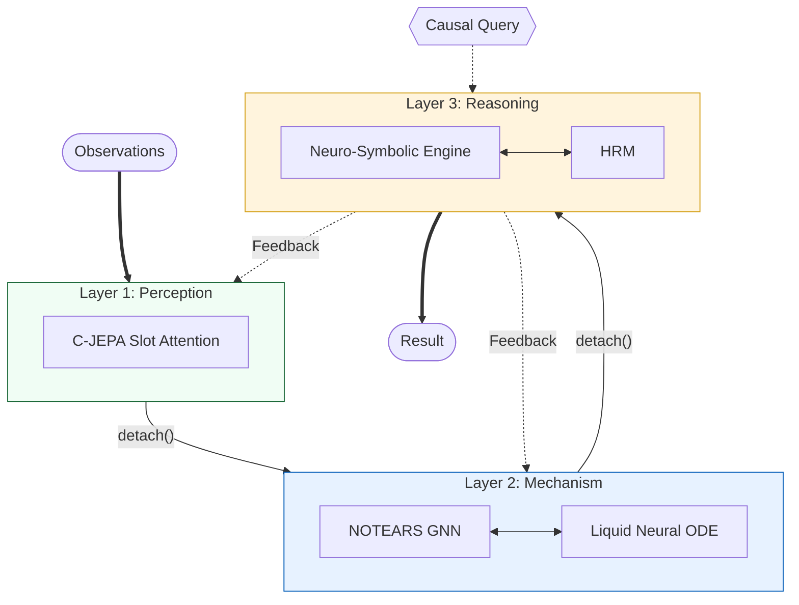

# HHCRA: Hierarchical Hybrid Causal Reasoning Architecture


A three-layer neuro-symbolic architecture for Structural Causal Model (SCM) estimation and causal inference across Pearl's three-level causal hierarchy (association, intervention, counterfactual).

## Overview

HHCRA decomposes SCM inference into three hierarchical layers with gradient isolation between layers and tight coupling within layers. Each layer is trained independently via staged optimization.

### SCM Formulation

The architecture maps to the SCM tuple $M = \langle V, U, F, P(u) \rangle$:
- $V$: Endogenous variables, extracted by Layer 1.
- $U$: Exogenous noise variables (stochastic components).
- $F$: Structural equations, modeled by Layer 2 dynamics.
- $G$: Causal DAG, learned via NOTEARS continuous optimization.

### Architecture



### Component Mapping

| SCM Component | Module | Layer |
|---|---|---|
| $V$ (Variables) | C-JEPA | 1 |
| $G$ (Topology) | Causal GNN (NOTEARS) | 2 |
| $F$ (Mechanisms) | Liquid Neural Network | 2 |
| $P(Y \mid do(x))$, $P(Y_{x'} \mid x, y)$ | Neuro-Symbolic Engine | 3 |
| Reasoning orchestration | HRM (GRU + ACT) | 3 |

## Method

### Layer 1: Latent Variable Extraction
Causal Joint Embedding Predictive Architecture (C-JEPA). Slot attention with competitive softmax decomposes observations into $N$ latent variable representations. Temporal consistency is enforced via exponential smoothing. Training objective: masked slot prediction.

### Layer 2: Structure and Mechanism Learning
- **Structure**: NOTEARS (Zheng et al., 2018) augmented Lagrangian formulation: $\min_W F(W) + \lambda \|W\|_1 + \alpha \cdot h(W) + \frac{\rho}{2} h(W)^2$, where $h(W) = \mathrm{tr}(e^{W \circ W}) - d$.
- **Dynamics**: Liquid Time-Constant Networks (Hasani et al., 2021) with per-variable ODE $dx_i/dt = g_i \cdot (-x_i + f_i(x_i, \mathrm{pa}_i)) / \tau_i$. Integration via RK4.

### Layer 3: Causal Reasoning
- **Symbolic inference**: d-separation (Bayes-Ball), backdoor/frontdoor criteria, do-calculus (3 rules), ID algorithm (Tian & Pearl, 2002), instrumental variable detection.
- **Counterfactuals**: Abduction-Action-Prediction (ABP) with additive Gaussian noise model.
- **HRM**: Hierarchical Reasoning Model with dual-timescale GRU recurrence and Adaptive Computation Time (Graves, 2016).

## Limitations

- **DAG assumption**: NOTEARS enforces acyclicity. Cyclic causal structures are not supported.
- **Linear structural model**: The NOTEARS fitting loss assumes linear mechanisms. Nonlinear relationships require the NOTEARS-MLP variant (not implemented).
- **Variable alignment**: Slot attention does not guarantee bijective correspondence between learned slots and true causal variables. This is the primary bottleneck for end-to-end structure learning accuracy (see `results/REPORT.md`).
- **Scale**: Evaluated on graphs with 3--8 variables. Scalability to larger graphs (50+ variables) has not been tested.
- **Counterfactual noise model**: ABP assumes additive Gaussian exogenous noise. Performance degrades under non-Gaussian or heteroscedastic noise.
- **Computational cost**: Neural ODE integration (RK4/DOPRI5) incurs higher per-step cost than discrete-time models.

## Changelog

### v0.5.0
- Fixed incorrect adjacency matrix usage in counterfactual ABP: `answer_query()` now passes `mod_adj` (incoming edges removed) to the intervention step, rather than the unmodified `adj_tensor`.
- Replaced `list.pop(0)` with `collections.deque.popleft()` in all BFS traversals (d-separation, ancestors, descendants, topological sort).
- Vectorized Layer 1 `compute_loss` over the temporal dimension, removing the inner loop over timesteps.
- Replaced recursive `_power_subsets` with `itertools.combinations`.
- Added gradient clipping (`max_norm=5.0`) to all three training stages.
- Clamped DAG penalty $h(W) \geq 0$ to prevent negative values from floating-point error.
- Extended `HHCRAConfig` validation to cover `hrm_hidden_dim`, `hrm_max_steps`, `hrm_update_interval`, `hrm_momentum`, and training epoch counts.
- Added 24 regression tests (total: 170).

### v0.4.1
- Slot attention changed from independent sigmoid gating to competitive softmax.
- NOTEARS loss changed to per-variable formulation preserving per-dimension variance.
- Layer 3 training fixed: loss computed from HRM output tensor (previously used detached scalar).

## Verification

Evaluated on a 5-graph benchmark suite (chain, fork, collider, diamond, 8-variable complex). See `results/REPORT.md` for detailed metrics.

- **Unit tests**: 170/170 passing (`pytest tests/ -v`).
- **Structure learning**: SHD, TPR, FDR evaluated against ground truth adjacency.
- **Interventional accuracy**: Compared against naive baseline across all benchmark graphs.
- **ODE accuracy**: RK4 achieves machine-precision integration error ($\sim 10^{-19}$).

### Dependencies
- **Full architecture**: Python >= 3.8, PyTorch >= 2.0, SciPy >= 1.10, torchdiffeq >= 0.2.3, pytest >= 7.0
- **Standalone prototype** (`hhcra_v2.py`): NumPy and SciPy only (CPU, no PyTorch dependency).

### Execution
```bash
pip install -e ".[dev]"
python -m hhcra.main
```

## References

1. Pearl, J. (2009). *Causality: Models, Reasoning, and Inference*. Cambridge University Press.
2. Zheng, X. et al. (2018). DAGs with NO TEARS: Continuous Optimization for Structure Learning. *NeurIPS*.
3. Tian, J. & Pearl, J. (2002). On the Identification of Causal Effects. *UAI*.
4. Hasani, R. et al. (2021). Liquid Time-constant Networks. *AAAI*.
5. Graves, A. (2016). Adaptive Computation Time for Recurrent Neural Networks. *arXiv:1603.08983*.
6. Locatello, F. et al. (2020). Object-Centric Learning with Slot Attention. *NeurIPS*.
